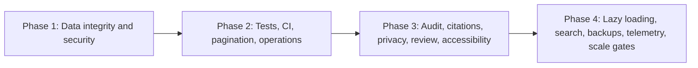

# Gia Phả ABC Recommended Roadmap Implementation Plan

> **For agentic workers:** REQUIRED SUB-SKILL: Use superpowers:subagent-driven-development (recommended) or superpowers:executing-plans to implement this plan task-by-task. Steps use checkbox (`- [ ]`) syntax for tracking.

**Goal:** Coordinate the complete audit roadmap from critical data-integrity fixes through production stabilization, product maturity, and measured scaling.

**Architecture:** Execute four release phases in strict order. Each phase produces a deployable, independently verified improvement and must satisfy its release gate before work begins on the next phase; the Next.js/Supabase monolith remains intact unless Phase 4 measurements prove a different architecture is necessary.

**Tech Stack:** Next.js 16, React 19, TypeScript 5, Tailwind CSS 4, Supabase Auth/PostgreSQL/RLS/Storage, Bun, ESLint, Vitest, pgTAP/Supabase CLI, Playwright where browser verification is required, GitHub Actions.

## Global Constraints

- Follow repository `AGENTS.md` and `DESIGN.md`.
- Do not invent UI tokens.
- Persistent tests serving CI may be committed under `tests/` and `supabase/tests/`; temporary tests, fixtures, benchmark output, screenshots, and debug files stay under `tmp/`.
- Prefer PostgreSQL transactions and constraints over compensating application code when all affected state lives in PostgreSQL.
- Use compensation only for cross-system workflows involving Supabase Storage, email, or external APIs.
- Keep RLS enabled on all exposed tables and test every role matrix.
- Do not return SQL details, secrets, PII, tokens, or stack traces to clients.
- Do not add infrastructure before a measured requirement exists.
- Do not refactor unrelated code.
- Do not commit, create branches, or deploy unless the user explicitly requests it.

---

## Plan Set

1. [Phase 1 — Critical fixes](./2026-09-01-phase-1-critical-fixes.md)
2. [Phase 2 — Stabilization](./2026-09-01-phase-2-stabilization.md)
3. [Phase 3 — Product improvements](./2026-09-01-phase-3-product-improvements.md)
4. [Phase 4 — Scaling](./2026-09-01-phase-4-scaling.md)

## Dependency Graph



## Delivery Strategy

### Release 1: Protect existing data

Execute Phase 1 as the first production change. Do not combine it with UI redesign or optional product features.

Primary outcomes:

```text
atomic restore
correct custom-event restore
member read-only authorization
relationship graph invariants
atomic relationship creation
database value constraints
one migration source
CSP report-only
```

### Release 2: Make releases repeatable

Execute Phase 2 after a successful Phase 1 restore drill.

Primary outcomes:

```text
application and database tests
CI required checks
no silent 1,000-row truncation
global error handling
structured logs
health/readiness
safe Storage compensation
official Supabase Admin API
dependency automation
```

### Release 3: Improve data trust and collaboration

Execute Phase 3 after CI is stable and role behavior is covered by tests.

Primary outcomes:

```text
append-only audit history
bounded undo
sources and citations
duplicate review and merge
record-level privacy
review-before-publish
keyboard-accessible dialogs and controls
responsive verification
```

### Release 4: Scale only from evidence

Execute Phase 4 after real or realistic staging measurements show the supported dataset is approaching Phase 2 limits.

Primary outcomes:

```text
performance budgets
lazy bounded family graph queries
indexed Vietnamese search
optimistic concurrency
encrypted backups and restore drills
PII-safe telemetry
documented infrastructure decision gates
```

## Cross-Phase Interfaces

| Interface | Created | Used by |
|---|---|---|
| `public.restore_backup(jsonb)` | Phase 1 | Backup verification and restore drills in Phases 2 and 4 |
| Unified `MIGRATION_CATALOG` | Phase 1 | CI, deployment, restore drills |
| DB role tests | Phase 1 | Every later RLS migration |
| Vitest and `verify` scripts | Phase 2 | Phase 3 and 4 application tests |
| Structured error IDs/logging | Phase 2 | Audit, review, telemetry, operational alerts |
| Pagination helper | Phase 2 | Activity, citations, duplicates, reviews |
| Audit log | Phase 3 | Undo, concurrency conflicts, operational investigation |
| Privacy model | Phase 3 | Subtree and search RPCs in Phase 4 |
| Performance budgets | Phase 4 | Infrastructure decision gates |

## Required Review Gates

### Gate A — Before each migration

- [ ] Existing production data is checked for rows that would violate new constraints.
- [ ] Migration is idempotent where the project upgrade workflow requires reruns.
- [ ] RLS is enabled before granting exposed-table access.
- [ ] Privileged functions have safe `search_path`, explicit grants, and role tests.
- [ ] Rollback or forward-fix procedure is documented.

### Gate B — Before each application release

- [ ] Focused failing test existed before implementation.
- [ ] Focused tests pass.
- [ ] Full DB tests pass.
- [ ] Lint passes.
- [ ] TypeScript passes.
- [ ] Application tests pass.
- [ ] Production build passes.
- [ ] `git diff --check` passes.
- [ ] No secrets or PII were added to tracked files, logs, telemetry, screenshots, or fixtures.

### Gate C — Before production deployment

- [ ] Database backup completed.
- [ ] Migration tested on staging data representative of production volume.
- [ ] Role acceptance tests passed for admin, editor, member, inactive, and anonymous users.
- [ ] Critical user flow smoke tests passed.
- [ ] Release-specific rollback/forward-fix steps are available.
- [ ] Operator knows whether new environment variables are required.

## Recommended Execution Batches

Do not execute an entire phase as one unreviewed diff. Use these review-sized batches:

```text
Phase 1A: regression DB tests + transactional restore
Phase 1B: permissions + relationship integrity/RPCs
Phase 1C: value constraints + migration catalog + CSP

Phase 2A: test foundation + CI
Phase 2B: pagination + error boundaries + logging/health
Phase 2C: Storage compensation + Auth Admin API + dependency automation

Phase 3A: audit log + bounded undo
Phase 3B: sources/citations + duplicate merge
Phase 3C: privacy + review workflow
Phase 3D: accessibility + DESIGN.md + responsive verification

Phase 4A: baseline budgets + subtree RPCs + search
Phase 4B: optimistic concurrency + backup drills
Phase 4C: telemetry + load/privacy/recovery acceptance
```

## Definition of Done

The roadmap is complete only when:

```text
No known operation can delete existing domain data and return a partial restore.
Database constraints protect the genealogy graph from documented invalid states.
Role behavior matches documentation and is covered by DB tests.
Every release runs automated lint, typecheck, tests, DB tests, and build.
UI correctness does not depend on Supabase's 1,000-row response cap.
Failures have stable IDs, safe logs, health signals, and operator guidance.
Family data has provenance, history, bounded undo, privacy, and review controls.
Critical UI works by keyboard and at supported mobile/tablet/desktop viewports.
Large datasets use bounded queries and indexed search.
Backups are encrypted and proven restorable in an isolated environment.
Telemetry contains no genealogy PII.
Any added infrastructure is justified by recorded measurements and thresholds.
```

## Execution Handoff

Recommended starting point: `Phase 1A`, because it contains the confirmed destructive restore defect and leaves an executable regression test before changing production behavior.

Execution options after explicit user approval:

1. **Subagent-driven:** one bounded worker per task or review batch, with review between batches.
2. **Inline execution:** execute the selected batch in this task using checkpoints and focused verification.

No phase or batch should begin without a new explicit `ok` identifying the desired starting batch.
